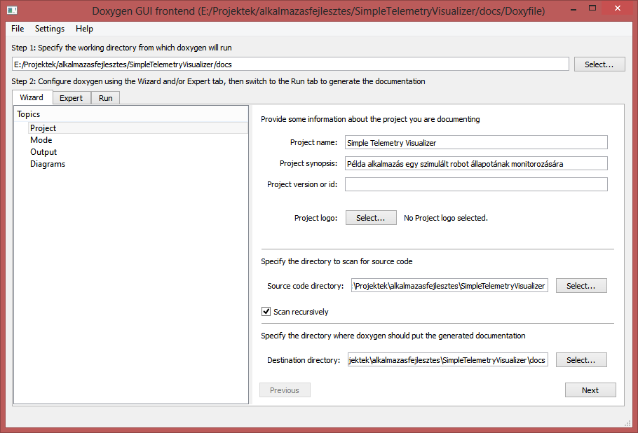
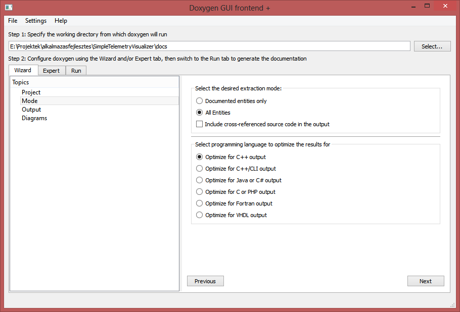
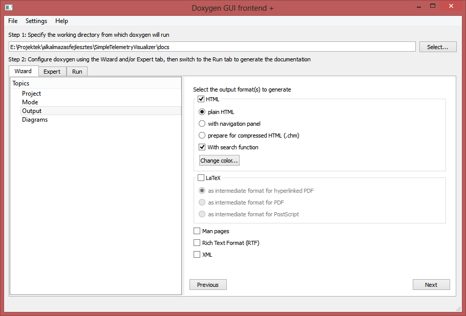
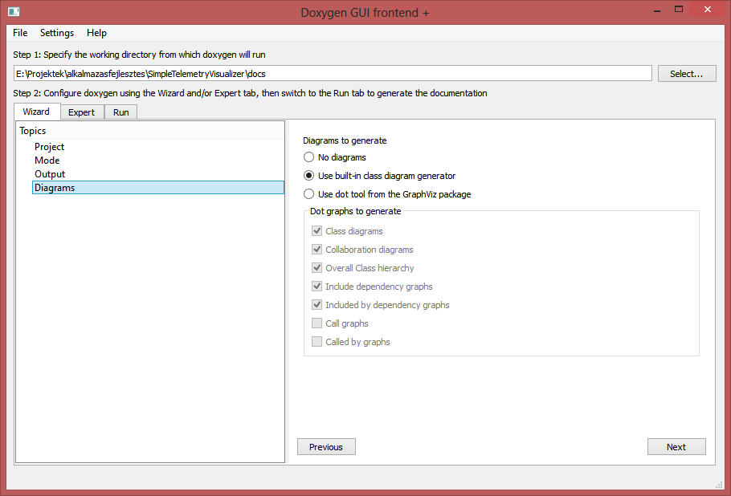
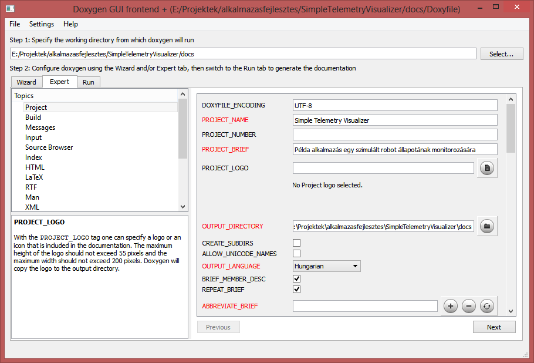
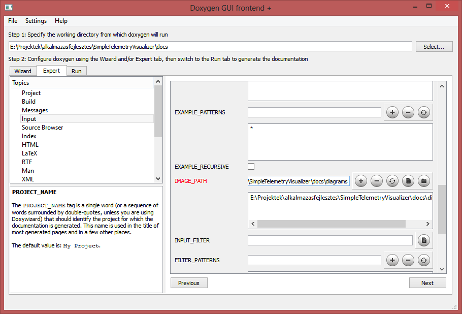
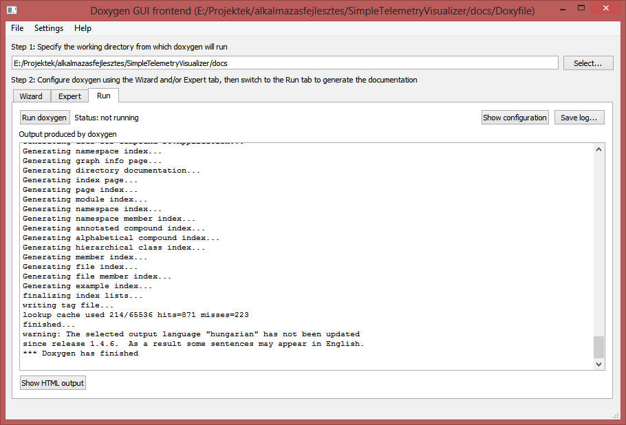

## A Doxygen használata

A doxygen (doxygen.org) egy forráskód alapján automatikusan dokumentációt generáló eszköz. Alapötlete, hogy a forráskódban (most C++ esetét nézve) az osztályokat, metódusokat és attribútumokat megfelelő formázással kommentezve, a forráskódot bejárva azokból esztétikus leírások készíthetők.

Számos programnyelvet támogat, a kommentárok formázásában támogatja a Markdown formátumot, kimenete pedig többek között lehet HTML vagy LaTeX forráskód is. 

Természetesen ennek egy fontos előfeltétele, hogy a kommentárokból tényleg egy használható dokumentáció álljon össze. Valószínűleg mindenki találkozott már olyan "dokumentációval", amiben fel volt sorolva (ömlesztve) az összes osztály, azokban meg lehetet nézni a metódusok listáját, de ezen kívül csak kb. annyira hasznos szövegek voltak benne, hogy "setX(int x)" metódus beállítja x értékét. Hát ezzel sokra megyünk...

Viszont a Doxygent nem ezek alapján kellene megítélni: nyilván a semminél lényegesen több időt igényel, de különösebb gond nélkül össze lehet rakni olyan dokumentációt, ami már tényleg használható. És ha nem egy a forráskódtól független dokumentum, akkor még annak is több az esélye, hogy a kód módosításai közben a dokumentáció is friss marad. (Ami valljuk be, egy hosszabb fejlesztési folyamat során nem mindig teljesül...)

Néhány szempont, amire érdemes figyelni a forráskód kommentezésénél, ha utána azt dokumentációnak is akarjuk használni:

  * Minden osztály előtt a header fájlban érdemes egy hosszabb kommentárban leírni, hogy az az osztály mire jó: ki használja és mire, hogyan működik és hogyan kapcsolódik a többi osztályhoz.
  * Ha az osztály előtt még egy példa is van a használatára (már amikor ennek van értelme), az nagyon-nagyon jól jön nekünk is, ha 6 hónappal később megint használnunk kell például a nagyon cselesen összerakott AbstractGraphBuilder magic osztályunkat, amire már csak homályosan emlékszünk.
  * A metódusok elé is illik odaírni, hogy mire jó. A Doxygennek külön megadhatjuk, hogy mi a leírása az egyes paramétereknek és a visszatérési értéknek.

Végül, de nem utolsó sorban nagyon fontos, hogy amit így generálunk, az referenciának jó (ha tudjuk, mit keresünk), de nulláról egy rendszer áttekintésére alkalmatlan, mert valószínűleg már az is csak nehezen derül ki, hogy az egésznek hol van az eleje. Éppen ezért szükség van még néhány áttekintő leírásra. A Doxygen lehetőséget ad arra is, hogy egy külön (például Markdown formátumban) elkészített dokumentumot megadjunk, mint kezdőoldal. Ha ide berakunk néhány UML diagrammot és azokon keresztül elmagyarázzuk, hogy hogyan működik a rendszer, akkor ezek alapján már sokkal könnyebb áttekinteni, hogy mi hol van. Utána pedig ha valakinek kellenek a részletek, akkor már tudni fogja, hogy mely osztályok leírásában kell tovább keresnie.

### A kommentárok mennyisége és a forráskód olvashatósága

Mielőtt nekilátunk a SimpleTelemetryVisualizer példaprogram dokumentációjának elkészítéséhez, egy fontos megjegyzés a kommentárok mennyiségéről: vannak helyek, ahol előírás, hogy a forráskódban a kommentároknak kell kitenniük a sorok felét. No ez szerintem egy kissé túlzás: ezzel pont azt érjük el, hogy a megoldás két nyelven van leírva: C++-ban és angolul, aminem nem sok értelme van. Ha a forráskódban normális váltózó- és függvénynevek vannak (és nem maci, teve, valami, a, b, c stb.), akkor a forráskód olvasható lesz. 

Az alábbi metódus szerintem elég egyértelmű, hogy mit csinál:

	void RobotProxy::accelerate()
	{
	    RobotState newState;
	    newState.setStatus(RobotState::Status::Accelerate);
	    newState.setA(1);
	    communication.send(newState);
	    qDebug() << "Gyorsítási parancs elküldve.";
	}

Lehetne még hozzá kommentárt írni, de minek. A header fájlban ott van előtte, hogy 1 m/s2 gyorsítási parancsot küld a robotnak. Ennyi pont elég.

## A Doxygen szintaxisa

Nézzük meg a SimpleTelemetryVisualizer Simulator.h fájljának elejét:

	#pragma once
	#ifndef SIMULATOR_H
	#define SIMULATOR_H
	#include <QObject>
	#include <QTimer>
	#include "Communication/CommunicationTcpSocketServer.h"
	#include "RobotState.h"
	
	/**
	 * @brief A robot szimulátor.
	 * 
	 * Van egy belső, RobotState típusú állapota, melyet egy QTimer segítségével periodikusan frissít.
	 * Létrehoz egy CommunicationTcpSocketServer objektumot a kommunikációhoz, amihez lehet csatlakozni.
	 * Minden szimulációs lépés után elküldi az állapotát.
	 * Ha egy RobotState objektumot kap, azt parancsként értelmezi.
	 */
	class Simulator : public QObject
	{
	    Q_OBJECT
	
	public:
	    /** Konstruktor.
	     * @param port  A port, amin a létrehozott szerver hallgatózik.
	    */
	    explicit Simulator(int port);
	    ~Simulator() = default;
	
	    /** Elindítja a szimulátort.
	     * @param intervalSec   A szimulátor periódusideje.
	     */
	    void start(float intervalSec);
 
A doxygen több jelölésrendszert is támogat ([részletek itt](http://www.stack.nl/~dimitri/doxygen/manual/docblocks.html#cppblock)), most itt csak az egyiket mutatom be. Minden kommentár eleje /**, a vége pedig */ kell, hogy legyen. Ezen belül mehet a szöveg, ami tartalmazhat Markdown jelöléseket, valamint speciális parancsokat. A parancsok @ jellel kezdődnek. A teljes lista [itt érhető el](http://www.stack.nl/~dimitri/doxygen/manual/commands.html), a legfontosabbak:

  * @brief: egy rövid leírás (Egy bekezdés, az első üres sorig tart.) A dokumentációban ez a rész szerepel majd elöl, a többi csak a részleteknél.
  * @param paraméternév leírás: egy metódus egy paraméterének a leírása
  * @returns: a visszatérési érték leírása
  * @warning: figyelmeztetések. Tipikusan piros vonallal emeli ki a doxygen.
  * @bug: ismert hibák
  * @note: megjegyzés, behúzott bekezdésbe kerül majd
  * @see vagy @sa: hivatkozás például másik osztály másik metódusára. A \:: jelölést felismeri a Doxygen.

A Doxygen a dokumentációt elsősorban a forráskód fájlokból generálja, de ezen kívül beolvassa többek között a txt és md kiterjeszésű fájlokat is. Így az alábbi parancsokkal több oldalas, tartalomjegyzékes, oldalak közötti hivatkozásokkal teleszőtt leírásokat is tudunk készíteni:

  * @page azonosito tényleges címsor
  * @section azonosito tényleges fejezetcím
  * @subsection azonosito tényleges alfejezetcím
  * @ref azonosito: hivatkozás az "azonosito" oldalára, fejezetére, alfejezetére stb.
  * @mainpage: ez az oldal lesz a főoldal, amivel a dokumentáció kezdődik. Ez a parancs csak egyetlen helyen szerepelhet, különben a Doxygen figyelmeztet és csak az elsőt veszi figyelembe.

Képekre a következő szintaxissal tudunk hivatkozni:
    \!\[\]\(eleresiUt\/Kepnev.png\)

(Képeknél fontos, hogy a Doxywizardban majd az Input/IMAGE_PATH-nak meg kell adnunk, hogy ezek a fájlok is másolódjanak át a dokumentációba.)

Ezek fényében a dokumentáció kezdő oldalának eleje az alábbi:

	@mainpage
	@tableofcontents
	
	@section Architektura Architektúra áttekintés
	
	A Simple Telemetry Visualizer (STV) alkalmazás három fő részből áll:
	
	   * Robot reprezentáció és szimuláció: ez felelős a robot állapotának követéséért, valamint a korábbi állapotok eltárolásáért a későbbi megjelenítéshez.
	   * Felhasználói felület: QML alapú megjelenítése a vezérlő nyomógomboknak, valamint az aktuális és korábbi állapotoknak.
	   * Kommunikáció: TCP/IP alapú kommunikáció a szimulációval. Kialakítása miatt könnyű az átállás más, péládul Bluetooth alapú kommunikációra. A kommunikációs adatcsomagok egyetlen osztály példányait küldik mindkét irányba (RobotState), ebben továbbítódnak a konkrét állapotok és a parancsok is.
	
	@section StvApplication StvApplication: az alkalmazás osztály
	
	Az StvApplication osztály egyetlen példányát hozza létre a main() függvény. A konstruktor létrehozza a további objektum példányokat, összekapcsolja őket. A main() függvény ezután elindítja a Qt fő eseménykezelő ciklusát.
	
	Az StvApplication környezetét az alábbi osztálydiagram ábrázolja:
	
	
	
	A CommunicationTcpSocket példánya felelős minden kommunikációért a kliens irányból (a másik a szimulátor, mely a mélyén tartalmaz egy CommunicationTcpSocketServer objektumot).
	
## Csoportsítási lehetőségek

http://www.stack.nl/~dimitri/doxygen/manual/grouping.html

TODO: nem akar működni... :(

## A Doxygen konfigurálása és futtatása

A Doxygen telepítése után a legegyszerűbb, ha a Doxywizard programot használjuk a konfigurálásra:

Az első képen beállítottam a projekt dokumentációjának könyvtárát (a Doxygen munkakönyvtára). Innen nyílik majd a html könyvtár, amiben a HTML dokumentáció lesz. Mellette van egy diagrams könyvtár is, ahova a képeket raktam. 

Amit itt könnyen ki lehet hagyni, az a "Scan recursively", pedig ha a forráskód könyvtárakba van rendezve (mint általában), akkor e nélül csak töredékét fogja megtalálni.

A Mode menüben érdemes beállítani, hogy ne csak azokat az entitásokat (pl. osztályokat) vegye bele a dokumentációba, amihez írtunk megjegyzést (dokumentációt), hanem mindet. "All entities".

Az Output oldalon én most Kikapcsoltam a LaTeX kód generálást.

A Diagrams oldalon ha fel lenne telepíte a GraphViz, annak az eszköztárával további és szebb diagrammokat tud készíteni a Doxygen, de ezt most nem kértem, így marad minden a default.

Néhány egyéb beállítás miatt át kell menni az Expert fülre:

A Projekt oldalon átállítottam az OUTPUT\_LANGUAGE beállítást magyarra.

Az Input oldalon az IMAGE\_PATH-hoz felvettem a docs/diagrams könyvtárat, hogy a képeket ott keresse, illetve ami még fontosabb, hogy ezeket másolja is bele a dokumentációba.

Ennek az oldalnak a végén van egy USE\_MDFILE\_AS\_MAINPAGE beállítás is. Ha nem használtuk a @mainpage parancsot egyetlen fájlban sem (jelen esetben az overview.md elején szerepel), akkor itt kell megadni, hogy melyik a kezdőoldal.

Továbbá ha szükséges, például itt lehet olyan fájlokat megadni, amit ki szeretnénk hagyni a feldolgozásból. (EXCLUDE beállítás)

Ezután nincs más teendő, mint elmenteni a Doxyfile-t (ez az alapértelmezett neve), majd a Run fülön rákattintani a "Run doxygen" gombra. Ha lefutott, alul a "Show HTML output"-ra kattintva meg is tudjuk nézni az eredményt.

 
(A githubon elérhető repositoryban természetesen a Doxyfile is benne van, így ott teljes egészében is meg lehet nézni.)

## Más forráskód alapú dokumentáció generáló rendszerek

A Doxygen működéséhez nagyon hasonló rendszer például a JavaDoc, mely a Java világ hasonló célú, mindenhol rendelkezésre álló dokumentáció generátora.

<small>Szerzők, verziók: Csorba Kristóf</small>
