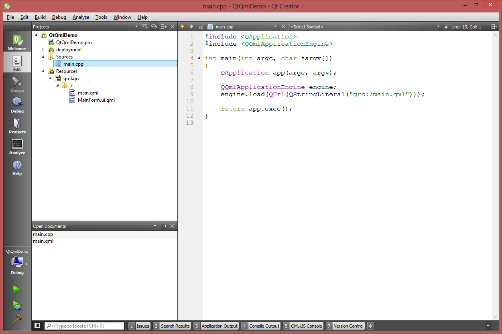
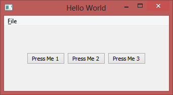

# QtQmlDemo

Ha a Qt Creator indítsakor Qt Quick Applicationt választunk, akkor rögtön kaptunk egy kis alkalmazás keretet, amivel QML-es alkalmazást tudunk készíteni. (A QtQuick az az osztálykönyvtár, aminek a felhasználó felület leíró nyelve a QML.)

A kiindulási alap így néz ki:

Elindítva az alkalmazást az alábbi ablakot kapjuk:

A File/Exit kilép, a többi művelet csak kiírja, hogy megtörtént az esemény.

Nézzük most végig, hogy miből áll ez a kis példaprogram.

## main.cpp

A main.cpp tartalma igen tömör:

	#include <QApplication>
	#include <QQmlApplicationEngine>
	
	int main(int argc, char *argv[])
	{
	    QApplication app(argc, argv);
	
	    QQmlApplicationEngine engine;
	    engine.load(QUrl(QStringLiteral("qrc:/main.qml")));
	
	    return app.exec();
	}

Létrehoz egy QApplication objektumot, aminek az app.exec() hívásával indul el az ablakkezelő rendszer eseménykezelő főciklusa. Vagyis a főprogram összerakja a felhasználó felületet, majd amíg ki nem lépünk, eseményekre vár és minden eseménynél végrehajtja a megfelelő eseménykezelőt.

Ezen kívül létrejön egy QQmlApplicationEngine objektum is, ami pedig a QML felület betöltéséért és felépítéséért felelős.

(A QStringLiteral majdnem ugyanaz, mintha QString()-et írnánk, csak fordítási időben létre tud jönni egy read-only QString objektum, így futási időben sokkal gyorsabb.)

Ami itt igazán érdekes, az a QML fájl és az elérési útja (URI-je): a QRC fájl egy un. resource leíró fájl. Ezt a bal oldali könyvtárszerkezetben is láthatjuk. A lényege, hogy az ebben a qml.qrc fájlban szerelő fájlok belefordulnak az exe fájlba, így a program viszi őket magával, nem kell külön fájlként odamásolni őket a telepítéskor. Ilyen erőforrások tipikusan a QML fájlok és például képek szoktak lenni.

## qml.qrc

A QRC fájl tartalma az alábbi (jobb klikk, Open in Text Editor):

	<RCC>
	    <qresource prefix="/">
	        <file>main.qml</file>
	        <file>MainForm.ui.qml</file>
	    </qresource>
	</RCC>

A lényege, hogy az itt felsorolt - egyébként a projektben létező - fájlok bekerülnek a fordításkor az exe fájlba. Hivatkozni rájuk úgy lehet, hogy a main() függvényben is láttuk, pl. "qrc:/main.qml". (A "/" prefixet már a QRC fájlban adtuk meg.)

## pro fájl

Még mielőtt a QML részbe belemennénk, nézzük meg a QtQmlDemo.pro projekt fájlt is.

	TEMPLATE = app

Ez jelenti azt, hogy egy futtatható alkalmazást szeretnénk. (És nem például libraryt.)
	
	QT += qml quick widgets
	
Szükségünk lesz a QT keretrendszerből a qml, quick és widgets. Widgeteket most nem használunk, viszont a QApplication osztály használatához is ez kell.
A háttérben ezek a beállítások példul bizonyos include és library fájl csoportok elérési útjait veszik hozzá a projektünkhöz.

	SOURCES += main.cpp
	
Forrás fájlunk csak egy van, a main.cpp.

	RESOURCES += qml.qrc
	
Resource leíró fájlunk is csak egy van, a qml.qrc (ami egyébként több fájlra hivatkozik, de ez más kérdés.)

	# Additional import path used to resolve QML modules in Qt Creator's code model
	QML_IMPORT_PATH =

Ha külső QML fájlokat is szeretnénk használni, itt adhatnánk meg a helyüket. Péládul ha egy nagyon szép grafikon rajzoló QML komponenst letöltünk. 
	
	# Default rules for deployment.
	include(deployment.pri)

Itt egy másik projekt fájlt includeolunk. A kiterjesztése azért pri és nem pro, hogy ez is jelezze, hogy ezt includolásra szánták.

A deployment.pri tartalmába most nem megyünk bele. Sok esetben nem is kell hozzányúlni. Elsősorban akkor van rá szükség, ha program telepítése valamiért speciális, például mert Android alatt processzor architektúra függő, hogy mi hol van a fájlrendszerben.

## MainForm.ui.qml

Ennek a fájlnak a tartalmát egyrészt megnézhetjük a QML designerben is, vagy szövegszerkesztőben is. (A bal oldali eszköztárban a "Design" és "Edit" gombokat kiválasztva.)

Ez a fájl egy összetett felhasználó felület elemet ír le: azt, ami a menü kivételével az alkalmazás ablakában megjelenik. Van rajta sorba rendezve 3 nyomógomb. 

	import QtQuick 2.4
	import QtQuick.Controls 1.3
	import QtQuick.Layouts 1.1

Itt különböző osztály csoportokat importálunk, hogy használhassuk őket. A nevük után a verziószámot is meg kell adni. Ezek a sorok kb. be is importálnak mindent, amire egy nem túl bonyolult felület összerakásához szükségünk van.
	
	Item {

Ez egy új felhasználói felület elem lesz. Mellesleg összetett, mert benne további elemek vannak.

	    width: 640
	    height: 480
	
Minden elemnek vannak tulajdonságai, propertyjei. Ezeket itt simán, számszerűen is beállíthatjuk, de majd később látni fogjuk, hogy akár JavaScript kódot is használhatunk a meghatározásukhoz, vagy az adatkötések segítségével megadhatjuk, hogy az értéküket mindig valahonnan máshonnan vegyék.

	    property alias button3: button3
	    property alias button2: button2
	    property alias button1: button1
	
A három Button control elég mélyen van a hierarchiában, így a könnyebb elérhetőség érdekében itt egy aliast hozunk létre nekik: kintről lehet majd úgy hivatkozni rájuk, mintha ezen a szinten lennének, közvetlenül az Item alatt, button1, button2 és button3 néven.

	    RowLayout {

A layout egy elrendezést irányító elem. Ami benne van, azokat úgy helyezi el, hogy sorban legyenek.

	        anchors.centerIn: parent
	
Maga a RowLayout is rendelkezik tulajdonságokkal. Ilyen az anchors. Itt lehet megadni, hogy a RowLayout elem határai hova igazodjanak. Itt most bárhogy is mozog vagy méreteződik az ablak, ő a szülőjének a közepén lesz. (Itt lehet például olyanokat is megadni, hogy minden irányba töltse ki a szülőt, ami jelen esetben az egyel kintebb definiált Item.)

	        Button {

Most egy Button osztályú elem jön.

	            id: button1

Ha konkrét azonosítót is szeretnénk a nyomógombnak adni, hogy tudjuk rá hivatkozni máshonnan, azt az "id" tulajdonság beállításával tudjuk megtenni. Eddig erre nem volt szükség, mert nem akarunk például magára a RowLayoutra hivatkozni. De most kelleni fog.

	            text: qsTr("Press Me 1")

A Buttonnak van egy text tulajdonsága, amit egy konkrét szövegre állítunk be. A qsTr() makrónak annyi feladata van, hogy jelzi, hogy ezt a stringet ha nemzetközi programot fejlesztünk, le kell fordítani, mert megjelenik a felhasználói felületen. Erre is van a Qt-nek támogatása, de ebbe most nem megyünk bele.

A további két Button hasonló az elsőhöz.

	        }
	
	        Button {
	            id: button2
	            text: qsTr("Press Me 2")
	        }
	
	        Button {
	            id: button3
	            text: qsTr("Press Me 3")
	        }
	    }
	}
	
Mint látható, itt a felhasználó felület felépítését adtuk meg, de a viselkedésről semmit nem mondtunk. Ez azért van, mert ez egy általánosabban használható felhasználói felület elem (bár most nyilván csak a main.qml-ből fogjuk egyszer példányosítani).

A lényeg, hogy a viselkedést majd ott adjuk meg, ahol felhasználjuk ezt a felület elemet.

## main.qml

A main.qml a felhasználó felületünk gyökéreleme. Definiál egy ablakot, benne egy menüt, valamint példányosítja a MainForm elemet (ami a MainForm.ui.qml fájlban van leírva) és beállítja az eseménykezelőket.

	import QtQuick 2.4
	import QtQuick.Controls 1.3
	import QtQuick.Window 2.2
	import QtQuick.Dialogs 1.2
	
	ApplicationWindow {
	    title: qsTr("Hello World")
	    width: 640
	    height: 480
	    visible: true

Az ApplicationWindow az alkalmazás főablakat. Beállítjuk a címét, méretét és láthatóságát.
	
	    menuBar: MenuBar {
	        Menu {
	            title: qsTr("&File")
	            MenuItem {
	                text: qsTr("&Open")
	                onTriggered: messageDialog.show(qsTr("Open action triggered"));
	            }
	            MenuItem {
	                text: qsTr("E&xit")
	                onTriggered: Qt.quit();
	            }
	        }
	    }

A menüsor egy MenuBar osztályó elem. A "menuBar : MenuBar" azt jeleti, hogy az ApplicationWindow menuBar tulajdonságának adunk értéket úgy, hogy az egy MenuBar osztályú elem lesz, aminek itt helyben adjuk meg az értékét. A MenuBar tartalmaz egy Menu elemet (ez lesz a File menü), aminek van címe, valamint benne vannak MenuItem-ek (Open és Exit). A címekben az "&" jel határozza meg a billentyűparancsokat: az Alt-F, Alt-O és Alt-x az egyes menüpontokat fogják aktiválni.

Ezeknek az elemeknek már eseményeik (signaljaik) is vannak. QML alatt az eseményeknek megfelelő signalokat JavaScript kódrészletekhez tudjuk kötni. A signal neve "Triggered", amihez kódrészletet az "onTriggered"-nek értéked adva tudunk rendelni. A fenti esetben az Open triggerére meghívjük a messageDialog objektum show() metódusát, az Exit esetében pedig a Qt.quit() hívással leállítjuk a programot.
	
	    MainForm {
	        anchors.fill: parent
	        button1.onClicked: messageDialog.show(qsTr("Button 1 pressed"))
	        button2.onClicked: messageDialog.show(qsTr("Button 2 pressed"))
	        button3.onClicked: messageDialog.show(qsTr("Button 3 pressed"))
	    }

Itt példányosítjuk a MainForm elemet. Az "anchors.fill" tulajdonságnak megadhatjuk, hogy az elem mely elemet töltse ki teljesen. Most a szülőt, ami az ApplicationWindow. Ezen kívül beállítunk eseménykezelőket is, miközben kihasználjuk, hogy a nyomógombok bár a MainForm mélyén vannak (egy RowLayout alatt), aliasokon keresztül könnyen le tudjuk őket érni.
	
	    MessageDialog {
	        id: messageDialog
	        title: qsTr("May I have your attention, please?")
	
	        function show(caption) {
	            messageDialog.text = caption;
	            messageDialog.open();
	        }
	    }

Végül létrehozunk még egy MessageDialog objektumot is az ablakon belül, ami egy felugró üzenet ablakot jelent. Adunk neki "id"-t, mert így tudunk rá hivatkozni az eseménykezelőkben. Beállítjuk a title tulajdonságot, valamint definiálunk benne egy JavaScript függvényt. Olyan ez, mintha egy MessageDialog osztályból származtattunk volna egy sajátot és kiegészítjük egy újabb metódussal. A függvény pedig nem tesz mást, mint a paraméterül kapott szövegre állítja a text tulajdonságot, majd feldobja a dialógus ablakot. (A JavaScript gyengén típusos nyelv, a paraméter típusát nem kell megadni. Lehet bármi, amit a változót használó kódrészek le tudnak majd kezelni.

	}

## Összefoglalás, a qrc_qml.cpp

Ezzel a végére is értünk a Qt QML-es példa keretprogramjának. A fordításkor megnézve a konzolt egy érdekes részre lehetünk figyelmesek:

	C:\Qt\5.4\mingw491_32\bin\rcc.exe -name qml ..\QtQmlDemo\qml.qrc -o debug\qrc_qml.cpp
	
	g++ -c -pipe -fno-keep-inline-dllexport -g -frtti -Wall -Wextra -fexceptions -mthreads -DUNICODE -DQT_QML_DEBUG -DQT_DECLARATIVE_DEBUG -DQT_QUICK_LIB -DQT_WIDGETS_LIB -DQT_GUI_LIB -DQT_QML_LIB -DQT_NETWORK_LIB -DQT_CORE_LIB -DQT_NEEDS_QMAIN -I..\QtQmlDemo -I"C:\Qt\5.4\mingw491_32\include" -I"C:\Qt\5.4\mingw491_32\include\QtQuick" -I"C:\Qt\5.4\mingw491_32\include\QtWidgets" -I"C:\Qt\5.4\mingw491_32\include\QtGui" -I"C:\Qt\5.4\mingw491_32\include\QtQml" -I"C:\Qt\5.4\mingw491_32\include\QtNetwork" -I"C:\Qt\5.4\mingw491_32\include\QtCore" -I"debug" -I"." -I"C:\Qt\5.4\mingw491_32\mkspecs\win32-g++" -o debug\qrc_qml.o debug\qrc_qml.cpp

Az első sor egy rcc.exe program segítségével a qml.qrc fájlból készít egy qrc_qml.cpp fájlt, a második pedig hozzáforítja azt a projekthez.

Ennek a generált cpp fájlnak igen tanulságos, bár mérsékelten olvasható a tartalma.

	[...]

	static const unsigned char qt_resource_data[] = {
	  // E:/Projektek/alkalmazasfejlesztes/QtQmlDemo/MainForm.ui.qml
	  0x0,0x0,0x2,0x42,
	  0x69,
	  0x6d,0x70,0x6f,0x72,0x74,0x20,0x51,0x74,0x51,0x75,0x69,0x63,0x6b,0x20,0x32,0x2e,
	  0x34,0xd,0xa,0x69,0x6d,0x70,0x6f,0x72,0x74,0x20,0x51,0x74,0x51,0x75,0x69,0x63,
	  0x6b,0x2e,0x43,0x6f,0x6e,0x74,0x72,0x6f,0x6c,0x73,0x20,0x31,0x2e,0x33,0xd,0xa,
	  0x69,0x6d,0x70,0x6f,0x72,0x74,0x20,0x51,0x74,0x51,0x75,0x69,0x63,0x6b,0x2e,0x4c

	[...]

	static const unsigned char qt_resource_name[] = {
	  // MainForm.ui.qml
	  0x0,0xf,
	  0x5,0xe3,0xf8,0x3c,
	  0x0,0x4d,
	  0x0,0x61,0x0,0x69,0x0,0x6e,0x0,0x46,0x0,0x6f,0x0,0x72,0x0,0x6d,0x0,0x2e,0x0,0x75,0x0,0x69,0x0,0x2e,0x0,0x71,0x0,0x6d,0x0,0x6c,

	[...]

A fájl binárisan tartalmazza az erőforrás fájlok tartalmát és neveit. Az első blokk a tényleges adattartalom, a második pedig egy részlet a fájlok neveiből. A nevek UTF-16 kódolással szerepelnek, vagyis minden karakter 2 bájt. A "0x0, 0x4d" péládul az M betű a MainForm elejéről.
 